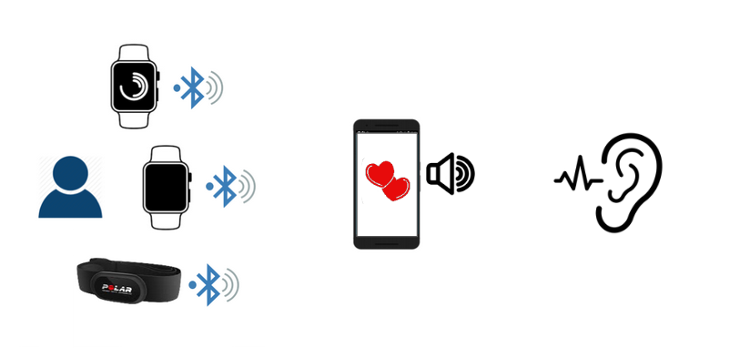

The HeartSync app is recording heart beats in real-time from a connected device and emits a heart beat sound.

  

## How to contribute

Please refer to [How To Contribute](https://github.com//blob/master/CONTRIBUTING.md)

## Pre-requisites
1. Android Sdk version 25.0
2. Connected device transfering HRV data through Heart Rate bluetooth profile
## References

Android Architecture Blueprints
[link](https://github.com/googlesamples/android-architecture)

iDevicesInc - SweetBlue - support multi Bluetooth connection on most Android platforms and devices
[link](https://github.com/iDevicesInc/SweetBlue)
